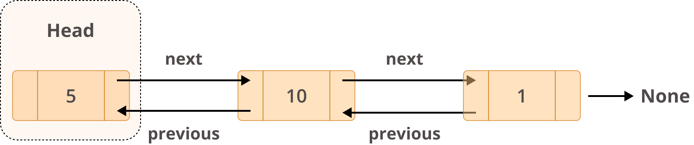

# Linked Lists

## Introduction
* Collection of data stored in a random way in memory
* Each element is called Node
* Each node contains a value and links to the previous and next node. Links are pointers to the location in memory of the other nodes.
* First node is called the head
* Last node is called the tail
* Applications: ...

## Structure

## Linked Lists in Python
* Using collections.deque
## Performance
O(n)
## Differences between a Linked List and a Dynamic Array
* The way they store elements in memory
## Example
* Example using collections.deque
## Problem to Solve
* Implement your own linked list ...
```
class Node:
    def __init__(self, data):
        self.data = data
        self.next = None
        self.prev = None
```

