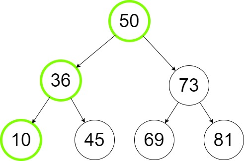
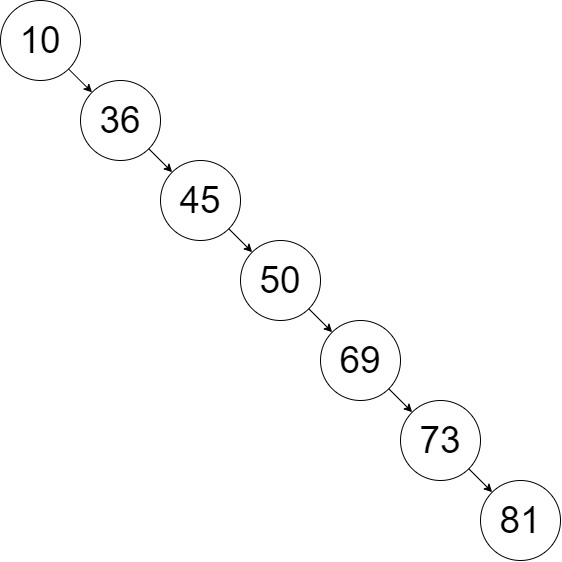

# Trees
## Table of Contents
* [Introduction](#introduction)
* [Binary Trees](#binary-trees)
* [Binary Search Trees](#binary-search-trees)
* [Balanced Binary Seach Trees](#balanced-binary-search-trees)
* [Recursion](#recursion)
* [Trees in Python](#trees-in-python)
* [Example](#example)
* [Problem to Solve](#problem-to-solve)

parent, child, subtrees, height

## Introduction
A tree is a nonlinear data structure that unlike arrays, lists, linked lists, stacks or queues which are linear structures, can have multiple other nodes connected to the same node. The first node is always called the __root__, and all the nodes without a connection are called __leaves__. There is not circular connections or unconnected nodes.

In this guide we will review the following types of trees: Binary Trees, Binary Search Tress and Balanced Binary Search Trees.

## Binary Trees
A Binary Tree is a type of tree that only allows at most two nodes connected to a single node. Those two nodes are often called __left child__ and __right child__. This type of trees are often used to implement binary search trees, and for efficient sorting or searching algorithms.
 
## Binary Search Trees
A binary search tree __(BST)__ is also known as an ordered or sorted binary tree because where new values are stored depends on whether they are larger or smaller than their parent node. The smallest values will be placed in the left child and the highest value will be placed in the right child. Having an structure like this is extremely efficient when it comes to sort a large collection of items. For example, let's insert the number 10 in the following tree.

To do it, we must follow the following steps:
1. Compare 10 and 50. Since 10 is less than 50 we keep looking at the left side of 50.
2. Compare 10 and 36. Since 10 is less than 36 we keep looking at the right side of 36.
3. Since there is an empty spot we can insert 10 at the left side of 36.

As you can see, a BST is extremely efficient because inserting and find a specific value in a BST is done by excluding [recursively](#recursion) a subtree, thus instead of performing a linear seach O(n) we reach an efficient of O(log n).

But notice that our three is balanced, in other words each side has almost the same height. If we would have the same values but inserted in this order: 

10, 36, 45, 50, 69, 73, 81

It would result in a tree like this.

## Balanced Binary Search Trees

## Recursion

## Trees in Python
## Example
## Problem to Solve