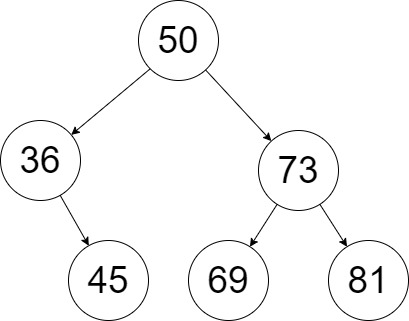

# Trees
## Table of Contents
* [Introduction](#introduction)
* [Binary Trees](#binary-trees)
* [Binary Search Trees](#binary-search-trees)
* [Balanced Binary Seach Trees](#balanced-binary-search-trees)
* [Recursion](#recursion)
* [Trees in Python](#trees-in-python)
* [Example](#example)
* [Problem to Solve](#problem-to-solve)

parent, child, subtrees, height

## Introduction
A tree is a nonlinear data structure that unlike arrays, lists, linked lists, stacks or queues which are linear structures, can have multiple other nodes connected to the same node. The first node is always called the __root__, and all the nodes without a connection are called __leaves__. There is not circular connections or unconnected nodes.

In this guide we will review the following types of trees: Binary Trees, Binary Search Tress and Balanced Binary Search Trees.

## Binary Trees
A Binary Tree is a type of tree that only allows at most two nodes connected to a single node. Those two nodes are often called __left child__ and __right child__. This type of trees are often used to implement binary search trees, and for efficient sorting or searching algorithms.
 
## Binary Search Trees
A binary search tree __(BST)__ is also known as an ordered or sorted binary tree because where new values are stored depends on whether they are larger or smaller than their parent node. The smallest values will be placed in the left child and the highest value will be placed in the right child. Having an structure like this is extremely efficient when it comes to sort a large collection of items. For example, let's insert the number 10 in the following tree.



To do it, we must follow the following steps:
1. Compare 10 and 50. Since 10 is less than 50 we keep looking at the left side of 50.
2. Compare 10 and 36. Since 10 is less than 36 we keep looking at the right side of 36.
3. Since there is an empty spot we can insert 10 at the left side of 36.


As you can see, a BST is extremely efficient because inserting and find a specific value in a BST is done by excluding [recursively](#recursion) a subtree, thus instead of performing a linear seach O(n) we reach an efficient of O(log n).

But notice that our three is balanced, in other words each side has almost the same height. If we would have the same values but inserted in this order: 

10, 36, 45, 50, 69, 73, 81

It would result in a tree like this:


## Balanced Binary Search Trees

A Balanced Binary Search Tree is a BST which ensures that all the subtrees heights are almost the same. There are a variety of algorithms used to ensure this property in a BST.  

In the next example, you can see how a balanced binary search tree is created from an array taking the middle value of the array and setting it as the root and then continue doing the same with each remaining section.


## Recursion

Recursion is a technique used in programming to call a function inside the same function. It is used for procesess that require to follow the same logic but with different inputs provided each time the function is called.

Recursion and trees are good friends. Since inserting and traversing a tree is a repetitive process of comparing and taking different paths, recursion is the best technique to accomplish this purpose. 

Let's analyze the following block of code:

```python
def  print_n_numbers(n):
    print(n)
    print_n_numbers(n)
```

The purpose of the function above is to print all the number from n to 0. We used recursion in the third line to call again the function `print_n_numbers()` and passed 'n-1' as the argument to decrease n by 1 every time the function call. Nevertheless we are missing some things that are important when using recursion. If we run this program, the result would look like this:

```
>>> print_n_numbers(10)
10
9
8
7
6
... 
-983
-984
-985

RecursionError: maximum recursion depth exceeded while calling a Python object
```

### Recursion Rules

When using recursion, if there isn't a stop sign, the program could run forever, well actually, as shown in the error above, Python will stop the recursive call when it reaches a maximum number of calls.

These rules will help us to implement recursion succesfully in our programs.

1. __Base Case__ - This is the stop sign for recursion. The base case is the condition that will stop recursion.

2. __Smaller Problem__ - We need to define a way for recursion to reach it's base case, or in other words, each time a function is called we need to alter its input in some way with a smaller problem.

Using `print_n_numbers()` let's implement a base case and a smaller problem.

 ```python
 def  print_n_numbers(n):
    if n < 0: # base case
        return
    else:
        print(n)
        print_n_numbers(n-1) # smaller problem
 ```

Notice that adding a simple if/else statement could be enought to stablish a base case where recursion will stop, in this case, if n is less than 0. And we already have stablished a smaller problem, each the function is called n is reduced by 1 to reach the base case.

We will use recursion in the next examples to implement some functions that will help us undertand how trees work in a deeper way.

## Trees in Python
There is a way to implement trees in Python using third party libraries, but in this guide we will implement trees using classes and function for education purposes.

To implement a simple Binary Search Tree in Python we need to create a Node class first.

```python
class Node:
    def __init__(self, data):
        self.left = None
        self.right = None
        self.data = data
```

Once we have our Node class, we can initizalize a simple binary tree.

```
>>> root = Node(15)
# Tree Structure
#       10
#      /  \
#   None  None

>>> root.left = Node(7)
>>> root.right = Node(70)
# Tree Structure
#          10
#       /     \
#      7       70
#    /  \     /  \
# None None None None
```
We will see how to implement a Binary Search Tree and a Balanced Binary Search Tree in the Example later in this tutorial. But meanwhile, let's see the basic operations in a BST:

Table


## Example: INSERT UNIQUE VALUES ONLY

## Problem to Solve: CREATE TREE FROM SORTED LIST

